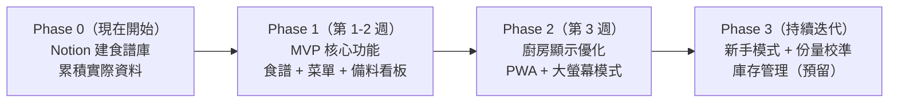
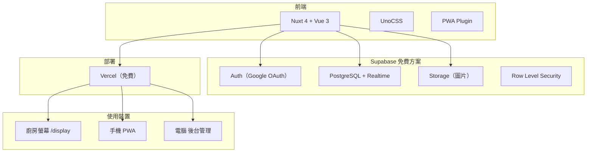

# 廚房互動管理系統 — 方案 B 執行規劃

## 決策摘要

- **選定方案**：方案 B — Nuxt 4 + Vue 3 + Supabase 全自建
- **餐廳規模**：每餐約 30 人，午餐 + 晚餐，同時操作 3-5 人
- **食譜資料策略**：先用 Google Sheets / Notion / Airtable 累積原始資料 → 匯出 CSV 匯入系統
- **部署方式**：雲端部署（Vercel + Supabase），家裡連網即可使用
- **網域**：MVP 階段先用 Vercel 免費網址（如 `kds-gc.vercel.app`），穩定後再考慮購買自訂網域
- **GitHub**：[https://github.com/reDawsonLin/KDS-GC.git](https://github.com/reDawsonLin/KDS-GC.git)

---

## 開發時程與階段規劃

### Phase 0：資料準備（現在就可以開始，與開發並行）

用任一工具先建立食譜資料庫，邊實際使用邊累積資料：

- **Google Sheets**（推薦）：門檻最低、大家都會用、手機可編輯、匯出 CSV 最直接
- **Notion**：有資料庫檢視模式，可匯出 CSV/Markdown
- **Airtable**：最接近資料庫結構、有完整 API，但免費版限 1000 筆

建議欄位：

- 菜名、分類（主菜/湯品/小菜/主食）
- 食材清單（名稱、大概用量、單位 — 能寫多少寫多少）
- 步驟描述（文字為主，有照片更好）
- 備註（主廚的眉角、注意事項）

目的：讓主廚在日常中慢慢把腦中知識外化，不用一次寫完。等系統做好後，這些資料可以直接匯入（CSV 格式）。

#### Google Sheets 建議欄位（匯入友善格式）

**分頁 1：食譜（recipes）**

- name — 菜名（如「紅燒肉」）
- category — 分類，統一用：主菜 / 湯品 / 小菜 / 主食 / 甜點
- servings_base — 這份食譜是幾人份（如 4）
- prep_time — 備料時間，分鐘，選填
- cook_time — 烹調時間，分鐘，選填
- notes — 主廚備註（眉角、注意事項）

**分頁 2：食材（ingredients）**

- recipe_name — 對應哪道菜（需與分頁 1 的 name 完全一致）
- ingredient — 食材名稱（如「五花肉」）
- amount — 用量數字（可留空）
- unit — 單位（克、ml、顆、把...）
- amount_type — 三選一：precise（精確）/ vague（模糊）/ undefined（未定義）
- amount_note — 模糊描述，amount_type 為 vague 時填寫（如「適量」「大概一碗」）

**分頁 3：步驟（steps）**（選填，可後續再補）

- recipe_name — 對應哪道菜
- step_order — 步驟序號（1, 2, 3...）
- description — 步驟說明

注意：欄位名稱建議用英文，匯入系統時可直接對應，不需再手動轉換。

### Phase 1：MVP 核心功能（第 1-2 週）

目標：**能在廚房實際使用，取代白板**

#### 1-1 專案骨架 + 登入系統（1-2 天）

- Nuxt 4 專案初始化、UnoCSS 設定
- Supabase 專案建立、資料庫 schema 建表
- Google OAuth 登入
- 白名單 + 角色權限（admin / member / viewer）
- 基本 Layout：側邊欄導航

#### 1-2 食譜管理（2-3 天）

- 食譜 CRUD：新增/編輯/刪除/列表
- 照片上傳（Supabase Storage）
- 食材清單：支援三種份量模式（精確/模糊/未定義）
- 步驟管理：圖文步驟
- 從 Notion/Airtable 匯入功能（CSV 或 JSON）
- 食譜搜尋 + 分類篩選

#### 1-3 今日菜單 + 備料看板（2-3 天）

- 主廚從食譜庫選菜到今日菜單（區分午餐/晚餐）
- 設定本餐人數，自動換算份量
- **依菜品視角**：每道菜需要什麼食材
- **依食材視角（備料總覽）**：每個食材被哪幾道菜使用，精確量自動加總

#### 1-4 備料互動 + 稽核（1-2 天）

- 備料任務認領 / 完成 / 取消
- Supabase Realtime 即時同步所有裝置
- 操作自動記錄：誰、什麼時間、做了什麼
- 出菜狀態追蹤

### Phase 2：顯示與體驗優化（第 3 週）

#### 2-1 廚房大螢幕模式（1-2 天）

- 獨立的 `/display` 路由，專為大螢幕設計
- 深色主題、大字體、顏色編碼（紅/黃/綠）
- 自動輪播或分區顯示（菜單區 + 備料進度區）
- 無操作自動刷新

#### 2-2 PWA + 手機體驗（1-2 天）

- PWA 設定：可加到手機主畫面
- 手機版操作介面：大按鈕、單手可操作
- 離線食譜瀏覽（Service Worker 快取）

### Phase 3：持續迭代

- 新手學習模式：食譜詳情 + 步驟照片 + 影片連結
- 食譜歷史紀錄 + 份量漸進校準
- 管理後台：操作紀錄查詢、成員管理
- 庫存管理（預留擴充）

---

## 技術架構

### 技術選型

- **前端**：Nuxt 4 + Vue 3 + UnoCSS
- **後端/DB**：Supabase（PostgreSQL + Realtime + Auth + Storage）
- **部署**：Vercel（免費方案，自動 CI/CD）
- **PWA**：`@vite-plugin-pwa`
- **圖片儲存**：Supabase Storage（免費 1GB）

### 部署方式說明

推薦雲端部署（Vercel + Supabase），原因：

- 免費方案完全夠用（這個量級連 1% 都用不到）
- 不需要維護伺服器
- 家裡任何裝置連網就能用，不受限區域網路
- 自動 HTTPS、自動部署
- 如果未來想改成自架，Supabase 也支援 self-hosted

### 網域（Domain）說明

- **MVP 階段**：使用 Vercel 免費提供的網址（如 `kds-gc.vercel.app`），功能完整、自帶 HTTPS
- **正式上線後**（可選）：購買自訂網域（如 `kitchen.yourname.com`），一年約 NT$300~600
- 隨時都可以加，不影響開發進程

### Supabase 是什麼？扮演什麼角色？

Supabase 是「後端即服務」（Backend as a Service, BaaS），它把傳統需要後端工程師做的事情全部打包成一個雲端服務。對本專案來說，**有了 Supabase 就不需要另外寫後端程式碼**。

Supabase 包含以下功能模組：

- **PostgreSQL 資料庫**：存放食譜、菜單、備料任務等所有資料
- **Auth 認證系統**：處理 Google 帳號登入、身份驗證
- **Storage 檔案儲存**：食譜照片上傳與管理
- **Realtime 即時同步**：A 手機打勾完成，B 螢幕馬上更新
- **RLS 權限控制**：資料庫層級的安全機制，控制誰能看什麼、改什麼

簡單理解：前端（Nuxt）負責畫面與互動，Supabase 負責所有「幕後」的資料處理與服務。

**免費方案 vs 實際用量：**

- 資料庫 500MB → 預估只用幾 MB
- 儲存空間 1GB → 食譜照片夠放幾百張
- 即時連線 200 個 → 最多同時 5 人使用
- 結論：免費方案綽綽有餘

---

## 資料模型

- **recipes（食譜）**：id, name, category, photo_url, servings_base, prep_time, cook_time, ingredients[], steps[], created_by, updated_at
  - ingredients 支援 amount_type: precise | vague | undefined
- **daily_menu（今日菜單）**：id, date, recipe_id, meal_period (lunch|dinner), servings, status, assigned_to
- **prep_tasks（備料任務）**：id, daily_menu_id, ingredient_name, amount, unit, status (pending|in_progress|done), claimed_by, completed_at, notes
- **prep_logs（操作稽核紀錄）**：id, prep_task_id, action (claimed|completed|unchecked), user_id, user_name, timestamp, note
- **members（成員白名單）**：id, email, role (admin|member|viewer), display_name, is_active, invited_by, created_at
- **recipe_history（食譜使用紀錄）**：id, recipe_id, date, meal_period, actual_servings, ingredient_adjustments, chef_note
- **inventory（食材庫存）**：預留擴充，MVP 不做

---

## 頁面路由規劃

- `/` — 首頁/今日總覽（今天午餐/晚餐的菜單與備料進度）
- `/login` — Google 登入頁
- `/recipes` — 食譜庫列表（搜尋、分類篩選）
- `/recipes/[id]` — 食譜詳情（食材、步驟、照片）
- `/recipes/new` — 新增食譜
- `/recipes/[id]/edit` — 編輯食譜
- `/menu` — 今日菜單管理（主廚用，拉菜到午餐/晚餐）
- `/prep` — 備料看板（依菜品視角）
- `/prep/overview` — 備料總覽（依食材視角）
- `/display` — 廚房大螢幕模式（全螢幕、深色、自動刷新）
- `/admin/members` — 成員管理（白名單、角色）
- `/admin/logs` — 操作紀錄查詢

---

## 廚房大螢幕 UI 設計原則

- 深色主題（廚房光線複雜，深色較清晰）
- 大字體（最小 20px）、大按鈕（最小 48x48px）
- 顏色編碼：紅色=未開始、黃色=進行中、綠色=完成
- 顯示裝置分工：大螢幕負責「全局顯示」，各人手機負責「操作互動」
- 大螢幕路由 `/display` 可設為自動輪播或分區佈局

## 登入與權限

- **Google OAuth**（Supabase Auth 內建），一鍵登入
- **白名單制**：管理者加入 Email 才能使用，未授權者顯示提示頁
- **三級角色**：admin（主廚，完整權限）/ member（幫手，操作備料）/ viewer（只看食譜）
- **停用機制**：is_active = false，保留歷史紀錄
- **Supabase RLS** 資料庫層級強制權限

## 操作稽核

- 每次備料狀態變更自動記錄：操作者（Google 帳號）、時間、動作
- 看板顯示「誰」在「什麼時候」完成
- 後台可依人員/時間篩選，支援異常偵測

## 食譜資料遷移策略

Phase 0 累積的食譜資料，可透過以下方式匯入系統：

- Google Sheets：直接下載為 CSV → 系統提供 CSV 匯入功能
- Notion：匯出為 CSV → 同上
- Airtable：透過 API 或匯出 CSV
- 匯入後可在系統內逐步補充照片、精確份量、步驟

